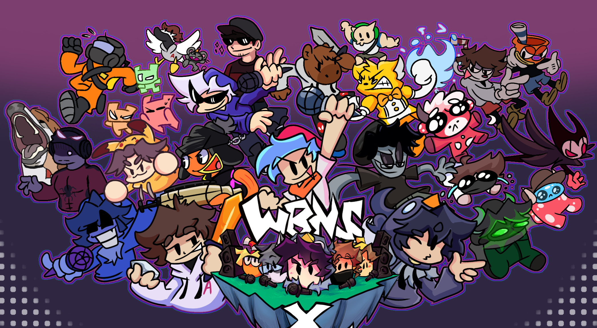

# WBNS x FNF
Made based on some videos or silly situations from a group of youtubers.

## Downloads

You can download the builded game from **[GameJolt](https://gamejolt.com/games/wbnsxfnfmod/904827)**

## Links

- WBNS x FNF: **[Twitter/𝕏](https://x.com/WBNSxFNFmod)**

- Funkin' Crew Links: **[FNF Official Website](https://funkin.me) ⋅ [itch.io page](https://ninja-muffin24.itch.io/funkin) ⋅ [Newgrounds](https://www.newgrounds.com/portal/view/770371) ⋅ [Source code on GitHub](https://github.com/FunkinCrew/Funkin)**

- Psych Engine (Engine used for the mod): **[Source code](https://github.com/ShadowMario/FNF-PsychEngine) ⋅ [Gamebanana Page](https://gamebanana.com/mods/309789)**

## Building

Refer to [BUILDING.md](BUILDING.md) on how you can build the first version of WBNSxFNF.
Also check [COMPILING.md](COMPILING.md) for the necessary versions of some libraries needed to build the game.

## Credits

All credits are in-game! But you can see them in [CreditsState.hx](source/states/CreditsState.hx)

## Special Thanks

- [mikolka9144](https://github.com/mikolka9144/P-Slice) - Results state port & Sticker transition
- [Rozebud](https://github.com/ThatRozebudDude/FPS-Plus-Public) - Note Hold Covers port
